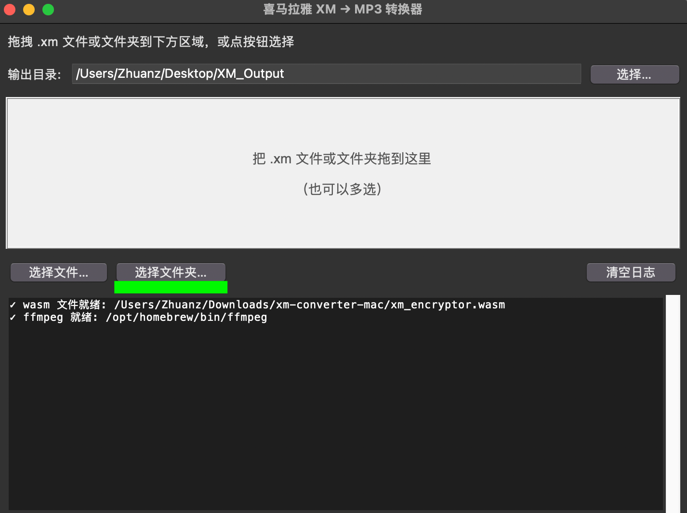

# 喜马拉雅 XM → MP3 批量转换器（Mac）

把整个专辑文件夹拖进窗口，几百集 .xm 一次全转 mp3。



## 怎么用

1. 点本页右上角 **`<> Code`** → **Download ZIP**，解压
2. 右键 `run.command` → 打开（首次会被 Gatekeeper 拦，按系统提示在"系统设置 → 隐私与安全性"里"仍要打开"）
3. 缺什么依赖会自动装。装 Homebrew 时会问您一次 y/n + 输一次开机密码，其他全自动
4. GUI 弹出后，把您的 .xm 文件或整个专辑文件夹拖进窗口

输出默认在 `~/Desktop/XM_Output/`。

## 跑不起来？

**不用研究报错。把问题甩给 AI 就行，实测可行。**

打开 [Claude](https://claude.ai)，新建对话，把下面这段粘进去：

```
我准备使用一个开源项目，地址：
[https://github.com/jinshanbaihai/xm-converter-mac]

请先访问这个仓库的 README 和它的上游项目
https://github.com/sld272/Ximalaya-XM-Decrypt
了解工具是做什么的、技术栈、已知坑。

我是不懂代码的 Mac 用户。接下来我会把终端报错直接粘给你，请：
1. 直接给我下一步要跑的命令，不要先解释原理
2. 一次一条，我跑完汇报结果再说下一步
3. 我说"看不懂"时换更简单的说法

准备好告诉我。
```

之后遇到任何报错，**直接复制粘贴**给它，按它说的命令做就行。

**为什么推荐 Claude**：实测在这类调试任务上 Claude 更愿意给具体命令、少废话。ChatGPT / Gemini / DeepSeek 也能用，效果差一些。

## 实测踩过的坑

| 报错关键词 | 怎么办 |
|---|---|
| `CERTIFICATE_VERIFY_FAILED` | 跑 `/Applications/Python\ 3.13/Install\ Certificates.command`（版本号换成您的） |
| Gatekeeper 弹"无法验证" | 系统设置 → 隐私与安全性 → 最底部 → "仍要打开" |
| 拖拽没反应 | 用 GUI 里的"选择文件夹"按钮 |
| 全部解密失败 | 喜马拉雅可能更新了加密，关注[原项目](https://github.com/sld272/Ximalaya-XM-Decrypt) fork |

## 如果 AI 也搞不定

开 issue，贴：macOS 版本、Python 版本、完整报错、AI 让您跑过的所有命令。

下一个遇到同样问题的人能搜到。

## 致谢

按贡献顺序：

1. **[@aynakeya](https://www.aynakeya.com/)** — XM 文件格式的逆向工程分析
2. **[sld272 / Diaoxiaozhang](https://github.com/sld272/Ximalaya-XM-Decrypt)** — 把逆向分析做成可用的 Python 工具。**本项目核心代码和 wasm 文件全部来自这里。** 觉得有用请先 star 这个仓库
3. **[Claude (Anthropic)](https://claude.ai)** — 所有 GUI 代码、Mac 兼容性修复、调试。这个 README 也是 Claude 写的

## 关于发起人

不懂代码。买了几百集喜马拉雅想导出来听，Mac 上没顺手的工具，花一个下午让 AI 做了一个。

贡献：提需求、测试、按发布键。

## 协议

MIT。`xm_encryptor.wasm` 权利属于原作者。

## 法律提示

仅供处理您**自己已购买/已下载**到本地的音频。不要传播版权内容。
